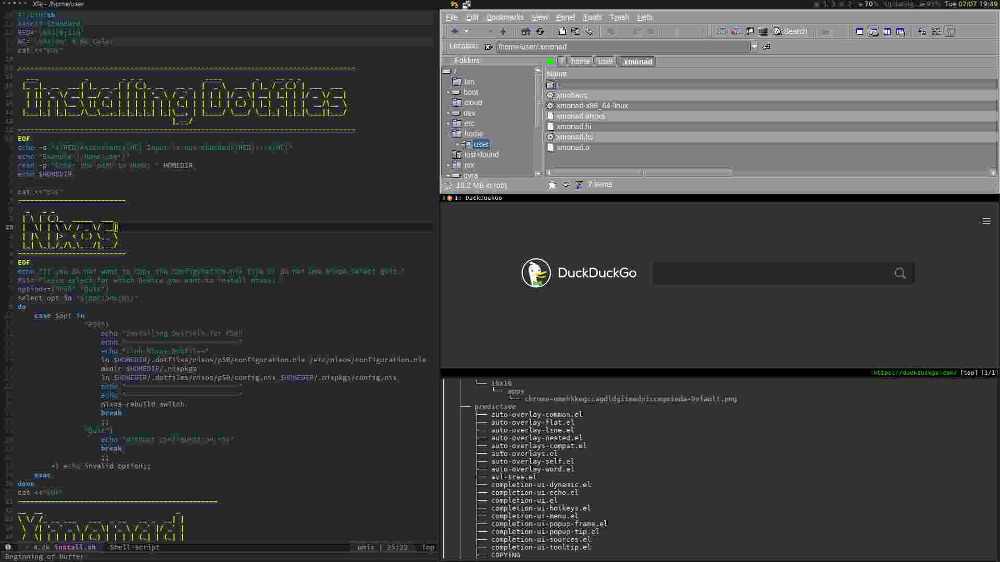

# dotfiles
**Table of Contents**

- [Introduction](#introduction)
- [Screenshot](#screenshot)
- [Programms](#programms)
- [Keybindings](#keybindings)
- [Install](#install)
- [License](#license)

# Introduction

This repository contains my dotfiles.
My Xmonad Config is heavly inspired by Shotaro Fujimoto.
Highly recommended to take a look at his Github page <https://github.com/ssh0/dotfiles>
# Screenshot

# Programs
| Programm      | Category              |
| ------------- | :-------------:       |
| beancount     | ledger                |
| emacs         | text editor           |
| mirage        | image viewer          |
| nm appleint     | network manager       |
| qutebrowser   | browser vim-like      |
| redshift      | color temperature     |
| rofi          | run dialog / dmenu    |
| roxterm       | terminal emulator     |
| shuttr        | screenshot tool       |
| trayer        | systray               |
| xfe           | file manager          |
| xmobar        | status bar            |
| xmonad        | tiling window manager |
# Keybindings
# Install
**You have to look at the configuration and adjust for your needs. If you have questions, feel free to ask.**
The script will ask you for your home direcoty and move the dofiles there. Following it will ask you which files you want to hardlink.
1. Clone the repository:
```sh
git clone https://github.com/Kanarme/dotfiles.git
```

2. Run the install.sh Script
If you want to install Nixos, you have to run the script as root.
```sh
.dotfiles/script/install.sh
```
It will ask you which dotfiles you want to install.
Note: P50 is my lenovo notebook.
Notebook specific icons and scripts are transferred, for example, battery indicator, wifi indicator and scripts to regulate the brightness.
You may need to change the rights and owner of the home directory
```sh
chown -R user:users /home/user
```

# License
All the files in this repository (except submodule) is under 
[WTFPL - Do What the Fuck You Want to Public License]
(http://www.wtfpl.net/).

See full text at [LICENSE](./LICENSE).
