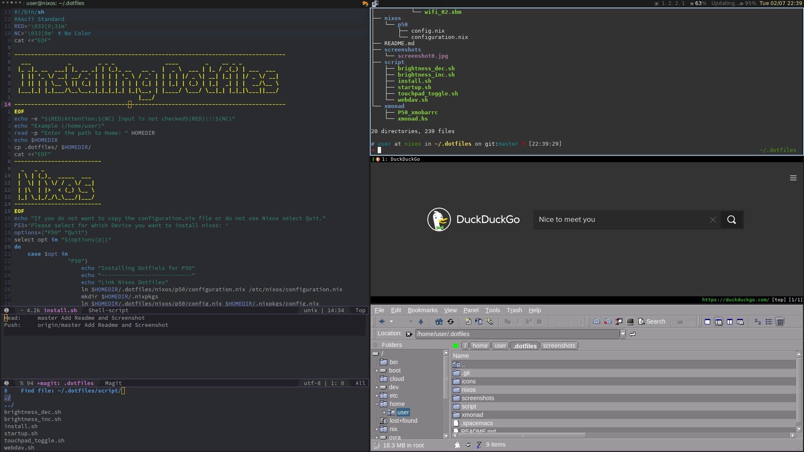

# dotfiles
**Table of Contents**

- [Introduction](#introduction)
- [Screenshot](#screenshot)
- [Programms](#programms)
- [Keybindings](#keybindings)
- [Install](#install)
- [License](#license)

# Introduction

This repository contains my dotfiles.
My Xmonad Config is heavly inspired by Shotaro Fujimoto.
Highly recommended to take a look at his Github page <https://github.com/ssh0/dotfiles>
# Screenshot

# Programs
| Programm      | Category              |
| ------------- | :-------------:       |
| beancount     | ledger                |
| emacs         | text editor           |
| mirage        | image viewer          |
| nm applet     | network manager       |
| qutebrowser   | browser vim-like      |
| redshift      | color temperature     |
| rofi          | run dialog / dmenu    |
| roxterm       | terminal emulator     |
| shuttr        | screenshot tool       |
| trayer        | systray               |
| xfe           | file manager          |
| xmobar        | status bar            |
| xmonad        | tiling Window Manager |
# Keybindings
# Install
1. Clone the repository:
```sh
git clone https://github.com/Kanarme/dotfiles.git
```

2. Run the install.sh Script
```sh
.dotfiles/script/install.sh
```
It will ask you which dotfiles you want to install.

# License
All the files in this repository (except submodule) is under 
[WTFPL - Do What the Fuck You Want to Public License]
(http://www.wtfpl.net/).

See full text at [LICENSE](./LICENSE).
